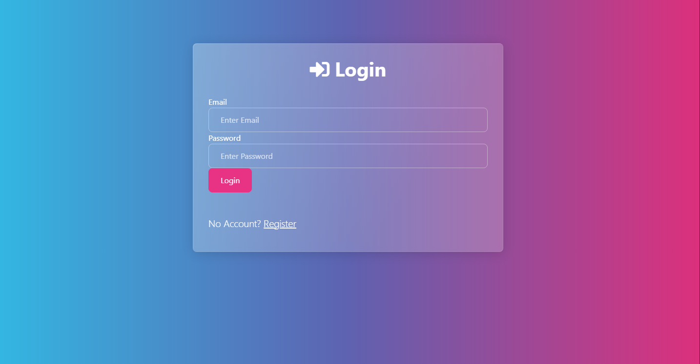

# AUTHENTICATION APP#
This is a user login and registration app using Node.js, Express, Passport, Mongoose, EJS, Bootswatch and some other packages. It is an extremely simple yet effective project to show more back and front end skills! I made the password requirments simple (at least 6 characters length) and used bootswatch for simple styling. If you travel to /dashboard without logging in you are redirected to the login page! Enjoy!

